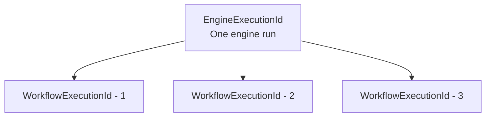
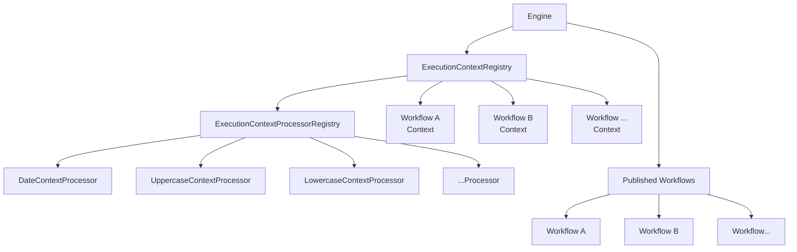

# Workflow Engine

## IDs

```mermaid
graph TD
    A[EngineExecutionId<br>One engine run] --> B[WorkflowExecutionId - 1]
    A --> C[WorkflowExecutionId - 2]
    A --> D[WorkflowExecutionId - 3]
```

## Engine Architecture

```mermaid
graph TD
    engine[Engine] --> contreg[ExecutionContextRegistry]
    contreg --> contprocreg[ExecutionContextProcessorRegistry]
    contreg --> context1[Workflow A<br>Context]
    contreg --> context2[Workflow B<br>Context]
    contreg --> context3[Workflow ...<br>Context]
    contprocreg --> proc1[DateContextProcessor]
    contprocreg --> proc2[UppercaseContextProcessor]
    contprocreg --> proc3[LowercaseContextProcessor]
    contprocreg --> ...Processor
    engine ----> workf[Published Workflows]
    workf --> workf1[Workflow A]
    workf --> workf2[Workflow B]
    workf --> Workflow...

```
